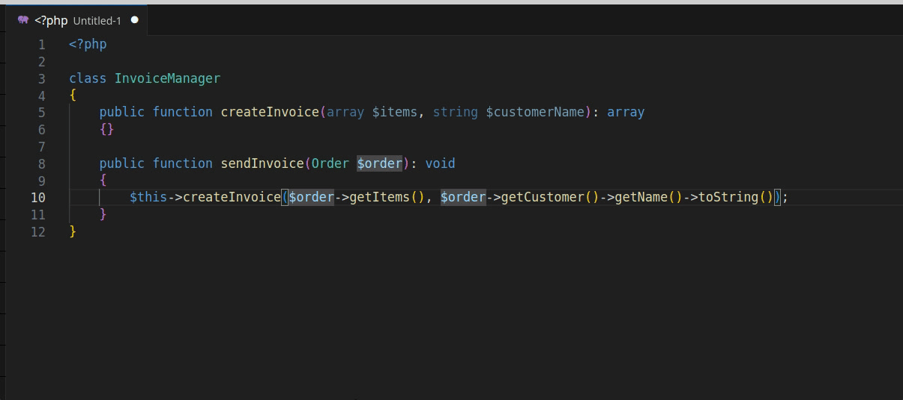

# PHP Variables Refactor

A simple extension for refactoring PHP function calls into variables right from the quick actions list.

## Features

## Extension Settings

This extension contributes the following settings:

- `phpVariablesRefactor.naming.type`: Choose your preferred naming type. Available options are `lowerCamelCase`, `CamelCase`, `snake_case` and `kebab-case`. Default is `lowerCamelCase`

## Contributing

I created this extension with it being free, open source and collectively supported in mind. Therefore don't expect big updates from me aside from critical bug fixes.

If you want a new feature I'll consider it, but since I'm not an expert with typescript (if you have checked the source code you probably already noticed that) I invite anyone to create a pull request and if it makes sense I'll support merging it.

## Release Notes

### 1.0.0

Initial release
